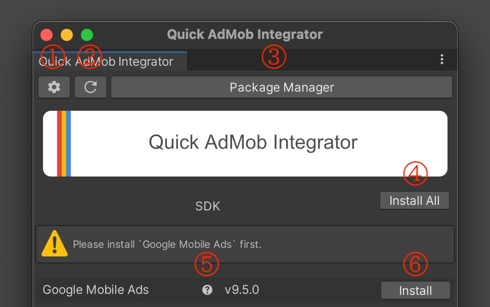

[README - 日本語版](README_jp.md)

> [!IMPORTANT]
> DISCLAIMER: Quick AdMob Integrator is an open-source tool and is not an official service by Unity Technologies Inc. It uses the Open UPM registry but is not affiliated with nor provided by Open UPM.

# Quick AdMob Integrator
Simplify the integration of Google AdMob into Unity and seamlessly set up mobile ads.

## Getting Started

### Installation via Git URL

Go to `Unity Editor: Window > Package Manager > Add package from git URL...`.

URL:  
`https://github.com/IShix-g/QuickAdMobIntegrator.git?path=Packages/QuickAdMobIntegrator`

### Open Quick AdMob Integrator

Access it via  
`Unity Editor: Window > Quick AdMob Integrator`

### Setting Up Registry

Click the `Set up required registries...` button.

### Open Settings

Click the settings icon (gear icon) in the toolbar.

### Choose Mediation Platforms

Deselect any mediation platforms that you do not need.

### Complete Setup

Click the back button to complete the initial setup.

### Install SDKs and Mediation Packages

Click the `Install All` button to install all displayed SDKs and mediation packages.

## Explanation of Buttons

1. Open Settings
2. Reload Packages
3. Open Unity Package Manager
4. Install or update all SDK and mediation packages

## Displaying Current Package Status

1. Installed and up-to-date
2. Installed but with updates available  
   Example: v3.13.1 (current) → v3.14.0 (new)
3. Not installed

## How the Plugin Works

This plugin operates by using `Open UPM` as a Scoped Registry.

You can check and manage it here:  
`Unity Editor: Project Settings > Package Manager > Scoped Registries`

Installation and uninstallation are handled through Unity Package Manager's built-in functionality. If you decide to remove this plugin, it will not affect the packages that were installed via the plugin.

You can view and manage installed packages under:  
`Unity Editor: Window > Package Manager > My Registries`

