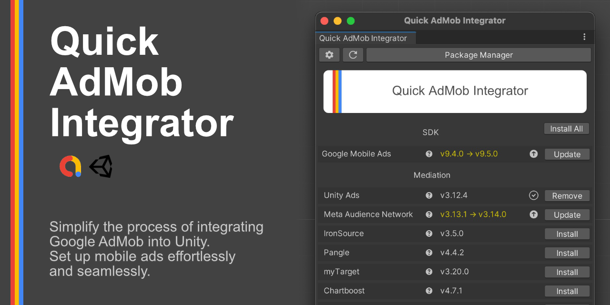
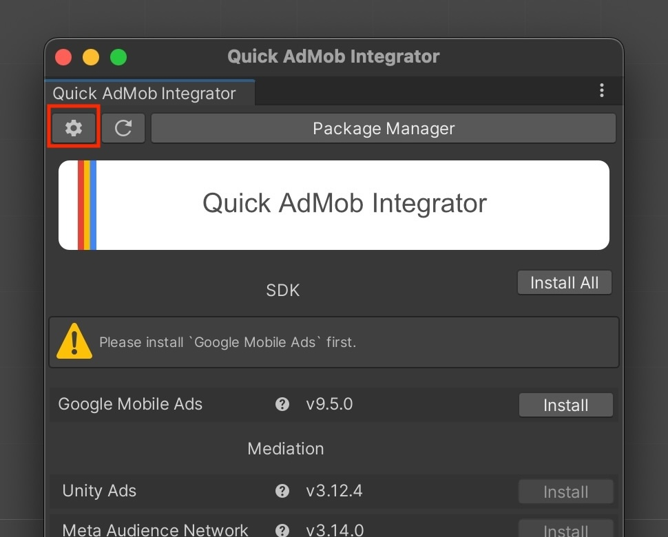
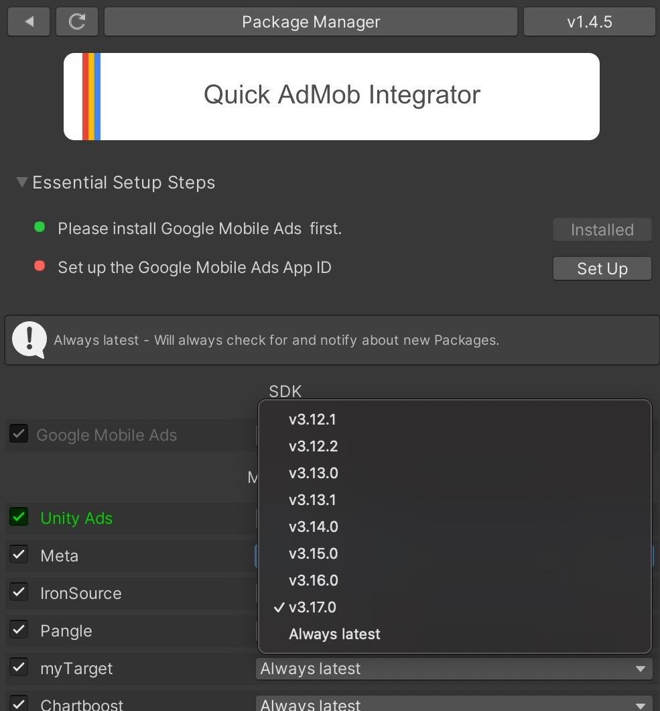
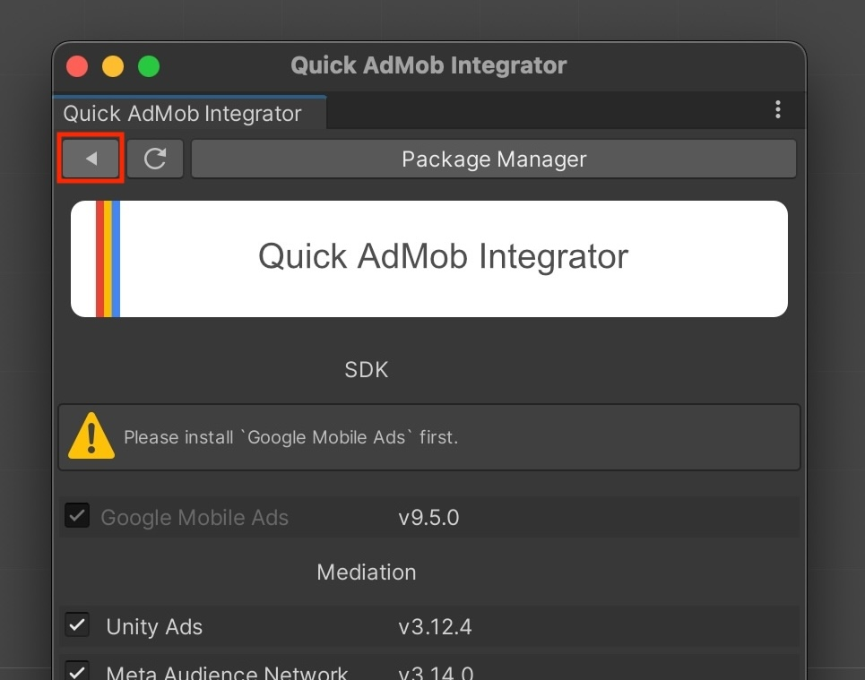

[README - 日本語版](README_jp.md)

> [!IMPORTANT]
> **Disclaimer:** Quick AdMob Integrator is an open-source service and is not an official service provided by Unity Technologies Inc. or Google Inc. Additionally, while it uses Open UPM for the registry, it is not a service provided by Open UPM.

# Quick AdMob Integrator
Simplify the integration of Google AdMob into Unity and seamlessly set up mobile ads.



- Easily install AdMob and mediation packages
- Quickly check for update information at a glance
- Built on the Unity Package Manager (UPM) for reliability

## Getting Started

### Installation via Git URL

Go to `Unity Editor: Window > Package Manager > Add package from git URL...`.

```
https://github.com/IShix-g/QuickAdMobIntegrator.git?path=Packages/QuickAdMobIntegrator
```


### Open Quick AdMob Integrator

Access it via  
`Unity Editor: Window > Quick AdMob Integrator`


### Setting Up Registry

Click the `Set up required registries...` button.


### Open Settings

Click the settings icon (gear icon) in the toolbar.



### Choose Mediation Platforms

Deselect any [mediation platforms](https://developers.google.com/admob/unity/mediation) that you do not need.

#### Mediation (Optional)
AdMob can be used without setting up [mediation](https://developers.google.com/admob/unity/mediation).  
If you want to maximize revenue by combining multiple ad networks, including non-AdMob ads, consider implementing mediation.


### {1.3.0} Package Selection Now Available

You can now select which packages to install.
If you want to always use the latest version, specify 'Always latest'. Note that even with 'Always latest' selected,
packages won't update automatically - you'll need to click the Update button.



### Complete Setup

Click the back button to complete the initial setup.



### For Those Who Have Already Installed AdMob

Please delete the following items:

- `Assets/ExternalDependencyManager`
- `Assets/GoogleMobileAds` (excluding `Resources`)
- `Assets/Plugins/Android/googlemobileads-unity.aar`
- `Assets/Plugins/Android/GoogleMobileAdsPlugin`
- `Assets/Plugins/iOS/GADUAdNetworkExtras`
- `Assets/Plugins/iOS/unity-plugin-library.a`
- Assets/Plugins/iOS/NativeTemplates/

### Install SDKs and Mediation Packages

Click the `Install All` button to install all displayed SDKs and mediation packages.


### {1.4.0} Added Notes Feature

A simple notes feature has been added.
For example, when specifying a package version, you can write down the reason for choosing that version, which can be
helpful when reviewing later.


## Explanation of Buttons


1. Open Settings
2. Reload Packages
3. Open Unity Package Manager
4. Install or update all SDK and mediation packages
5. View the Getting Started Guide / Help
6. Install packages

## Displaying Current Package Status


1. Installed and up-to-date
2. Installed but with updates available  
   Example: v3.13.1 (current) → v3.14.0 (new)
3. Not installed

## How the Plugin Works

This plugin operates by using [Open UPM](https://github.com/openupm/openupm) as a Scoped Registry.

You can check and manage it here:  
`Unity Editor: Project Settings > Package Manager > Scoped Registries`


Installation and uninstallation are handled through Unity Package Manager's built-in functionality. If you decide to remove this plugin, it will not affect the packages that were installed via the plugin.

You can view and manage installed packages under:  
`Unity Editor: Window > Package Manager > My Registries`

