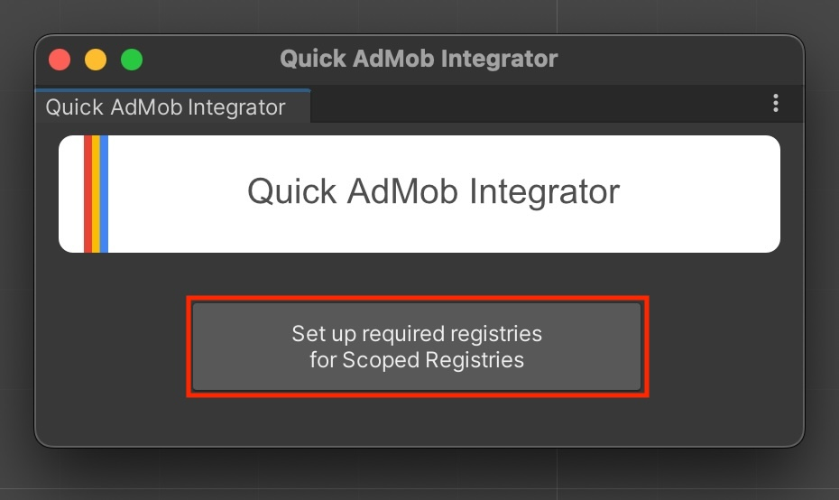
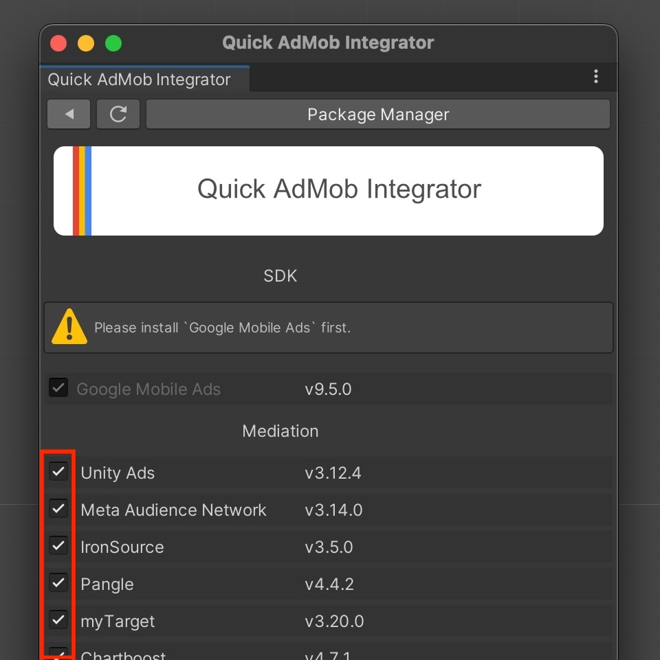

> [!IMPORTANT]
> 免責事項：Quick AdMob Integratorはオープンソースのサービスであり、Unity Technologies Inc.が提供する公式のサービスではありません。また、レジストリにOpen UPMを利用しますが、Open UPMが提供するサービスでもありません。

# Quick AdMob Integrator
UnityのGoogle AdMob統合を簡素化し、モバイル広告のシームレスなセットアップを提供します。

- Admobとメディエーションのパッケージを簡単にインストール
- 更新情報を一目で確認
- 内部ではPackage Manager(UPM)を利用しているので安心

## Getting Started

### Git Urlからインストール

"Unity Editor : Window > Package Manager > Add package from git URL...".

URL: `https://github.com/IShix-g/QuickAdMobIntegrator.git?path=Packages/QuickAdMobIntegrator`

### Quick AdMob Integratorを開く

`Unity Editor : Window > Quick AdMob Integrator`

### レジストリーの設定

`Set up required registries...`ボタンをクリック

### 設定を開く

歯車アイコンの設定をクリック

### メディエーションの選択

必要無いメディエーションの選択を外してください

### 設定の完了

戻るボタンをクリックして設定を完了します。

### Admobをインストール済みの方

下記を削除してください。

- Assets/ExternalDependencyManager
- Assets/GoogleMobileAds (Resources以外)
- Assets/Plugins/Android/googlemobileads-unity.aar
- Assets/Plugins/Android/GoogleMobileAdsPlugin
- Assets/Plugins/iOS/GADUAdNetworkExtras
- Assets/Plugins/iOS/unity-plugin-library.a

### SDKとメディエーションのインストール

`Install All`ボタンをクリックする事で表示されているすべてのSDKとメディエーションをインストールします。

## 各ボタンの説明

1. 設定
2. パッケージのリロード
3. Unity Package Managerを開く
4. すべてのSDKとメディエーションパッケージのインストールまたはアップデート
5. スタートガイド/ヘルプを表示
6. パッケージのインストール

## 現在のパッケージの状態表示

1. 最新バージョンのインストール済み
2. インストール済み、且つ更新可能な新バージョンあり v3.13.1 (現在) -> v3.14.0 (新)
3. 未インストール

## プラグインの仕組み

このプラグインは、`Open UPM`をScoped Registriesに設定して利用しています。

`Unity Editor: Project Settings > Package Manager > Scoped Registries`

インストールやアンインストールはUnity Package Managerの機能を利用しているので、もしこのプラグインが必要無くなって削除しても、インストールしたものに影響を与えません。

`Unity Editor: Window > Package Manager > My Registries`

